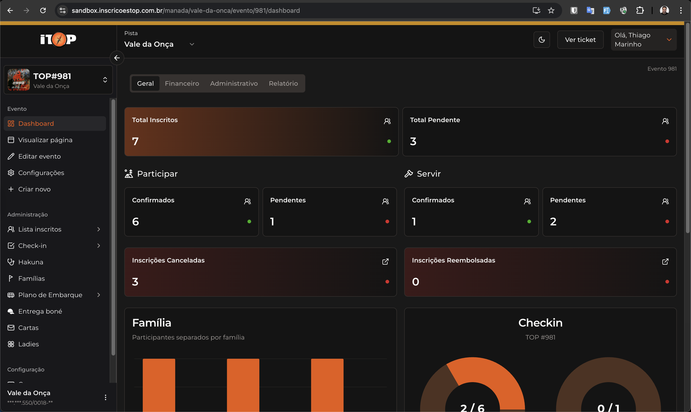
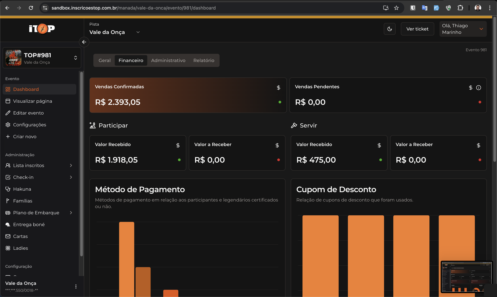
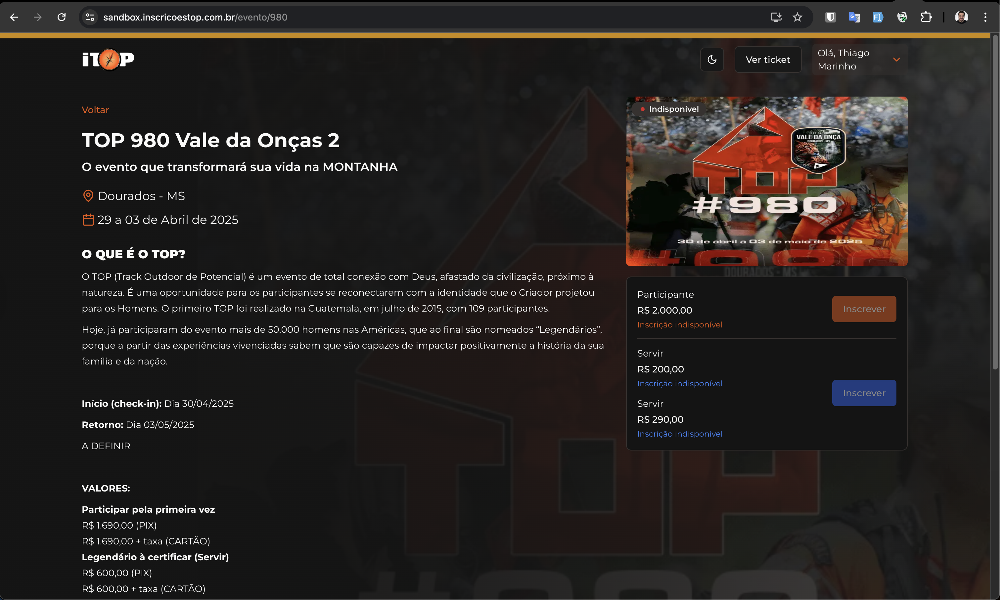
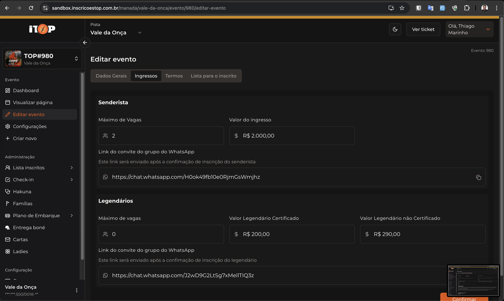
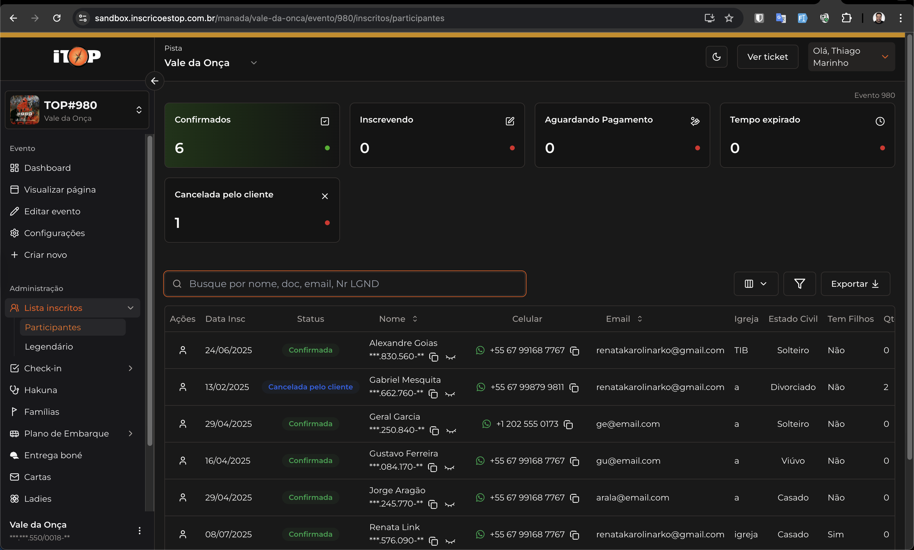
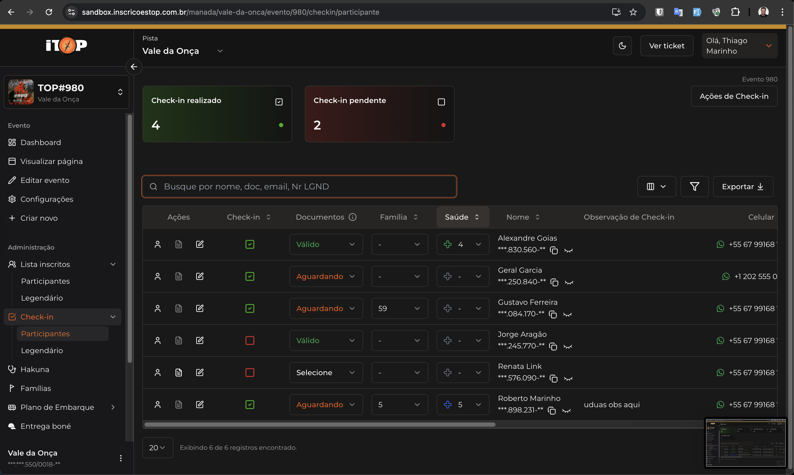
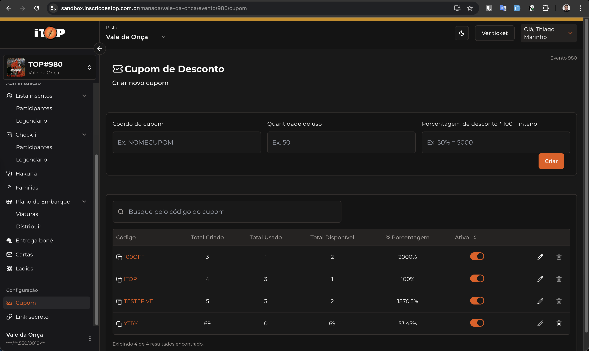
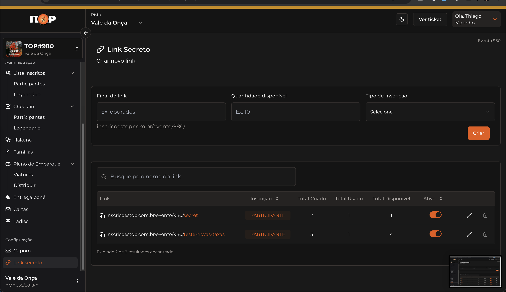

<div align="center">

# iTOP — Event Management & Registration Platform

**A full-stack SaaS platform for managing large-scale events end-to-end,  
from registration and payments to check-in and analytics.**

[](https://nextjs.org/)
[](https://www.typescriptlang.org/)
[](https://trpc.io/)
[](https://prisma.io/)
[](https://tailwindcss.com/)
[](./LICENSE)

[🇧🇷 Leia em Português](#-versão-em-português)

</div>

---

## 📌 Overview

**iTOP** (*Inscrições TOP*) is a production-grade, multi-tenant SaaS built to manage the full lifecycle of large events — from online registration and multi-method payment processing, to on-site check-in, real-time dashboards, and automated notifications.

It was designed and built for [Legendários](https://www.legendariosms.com/) events in Brazil — men's leadership retreats that bring together hundreds of participants and volunteers. The platform currently handles **real money**, **real events**, and **real users** in production.

> **Why this project matters:** It solves a genuinely complex domain — multi-tenant multi-role access, async payment reconciliation, offline-capable check-in, PDF/DOCX document generation, and deep third-party integrations — all in a clean, type-safe codebase from end to end.

---

## 🚀 Key Features

### 🏢 Multi-Tenant Architecture
- Each organization (*manada*) has its own isolated workspace with a unique slug
- Role-based access control (RBAC) powered by **CASL** with 7 permission levels:  
  `SUPER_ADMIN | ADMIN | BILLING | HAKUNA | CHECKIN | LADIES | USER`

### 📋 Event Management
- Full CRUD for events with rich metadata (dates, venue, capacity, pricing, WhatsApp groups, etc.)
- Event types: `LEGENDÁRIOS | REM | LEGADO_FILHA | LEGADO_FILHO`
- Configurable registration slots for participants and volunteers separately
- Public event landing pages with dynamic OG images

### 💳 Payment Processing
- **PIX** payments via [OpenPix / Woovi](https://woovi.com/) with real-time webhook reconciliation
- **Credit card** processing via [Asaas](https://asaas.com/) with installments (1–12x)
- Automatic fee calculation per payment method and number of installments
- Duplicate payment detection and refund handling
- Coupon / discount code system
- Financial dashboard with revenue breakdown

### ✅ Smart Check-In System
- QR Code scanning for participant check-in
- Dedicated flows for: **participants**, **volunteers (servir)**, **Hakuna** team, and **Manada Day**
- Real-time attendance tracking per role
- Cap/boné (branded hat) delivery confirmation

### 📊 Real-time Dashboard
- Registration funnel metrics (confirmed, pending, cancelled)
- Revenue tracking and payment status breakdown
- Per-event financial summary

### 📬 Automated Notifications
- **Email** notifications via [Resend](https://resend.com/) with React Email templates
- **WhatsApp** mass messaging with templated messages for participants and volunteers
- **Push notifications** via Web Push API
- **Discord** webhooks for internal alerts

### 📄 Document Generation
- PDF term generation (registration terms) via `jsPDF` and `pdf-lib`
- DOCX contract generation via `docx`
- Digital signature collection via [Autentique](https://autentique.com.br/) with biometric validation webhooks
- QR code generation for check-in badges

### 🚌 Transportation Planning
- Boarding plan builder: create vehicles, assign passengers, optimize routes
- PDF export of the complete boarding plan
- Drag-and-drop participant assignment

### 📦 Additional Modules
- **Secret Links**: time-limited private registration links
- **Family grouping**: link family members together across registrations
- **CSV import/export**: bulk data operations
- **File uploads**: event banners via [Uploadthing](https://uploadthing.com/)
- **Background jobs**: async processing with [Inngest](https://inngest.com/)

---

## 📸 Screenshots

### Dashboard — General Overview


### Dashboard — Financial


### Public Event Page


### Event Editor


### Registrations List — Filters & Search


### Check-In — Manual & QR Code


### Discount Coupons


### Secret Registration Links


---

## 🛠 Tech Stack

| Layer | Technology |
|---|---|
| **Framework** | [Next.js 14](https://nextjs.org/) (App Router, RSC, Server Actions) |
| **Language** | TypeScript 5.7 — strict mode throughout |
| **API** | [tRPC v11](https://trpc.io/) — end-to-end type-safe API |
| **Database** | MongoDB via [Prisma 5](https://prisma.io/) |
| **Auth** | [NextAuth.js v4](https://next-auth.js.org/) with Prisma adapter |
| **UI Components** | [shadcn/ui](https://ui.shadcn.com/) (Radix UI primitives) |
| **Styling** | [Tailwind CSS 3](https://tailwindcss.com/) |
| **State Management** | [Zustand](https://zustand-demo.pmnd.rs/) + [TanStack Query](https://tanstack.com/query) |
| **Tables** | [TanStack Table v8](https://tanstack.com/table) |
| **Forms** | [React Hook Form](https://react-hook-form.com/) + [Zod](https://zod.dev/) |
| **Email** | [React Email](https://react.email/) + [Resend](https://resend.com/) |
| **Background Jobs** | [Inngest](https://inngest.com/) |
| **File Storage** | [Uploadthing](https://uploadthing.com/) + [Vercel Blob](https://vercel.com/storage/blob) |
| **Charts** | [Recharts](https://recharts.org/) |
| **DnD** | [@dnd-kit](https://dndkit.com/) |
| **Testing** | Jest + Testing Library |
| **Linting** | ESLint + Prettier |
| **Deployment** | [Vercel](https://vercel.com/) |
| **Package Manager** | pnpm |

---

## 🏗 Project Architecture

```
src/
├── app/                        # Next.js App Router
│   ├── (pages)/
│   │   └── manada/[orgSlug]/  # Multi-tenant workspace (protected)
│   │       ├── evento/[numberTop]/
│   │       │   ├── dashboard/     # Analytics & metrics
│   │       │   ├── inscritos/     # Registrations (participants + volunteers)
│   │       │   ├── checkin/       # QR-based check-in flows
│   │       │   ├── pagamentos/    # Payments management
│   │       │   ├── cupom/         # Discount coupons
│   │       │   ├── plano-embarque/ # Transportation planning
│   │       │   ├── hakuna/        # Hakuna team management
│   │       │   ├── ladies/        # Ladies team management
│   │       │   ├── cartas/        # Letters / communications
│   │       │   ├── link-secreto/  # Secret registration links
│   │       │   └── familia/       # Family groupings
│   │       ├── legendarios/   # All-time members list
│   │       ├── membros/       # Organization members
│   │       └── settings/      # Org settings
│   └── top/[slug]/            # Public event pages
├── server/
│   ├── api/
│   │   ├── routers/           # tRPC routers (one per domain)
│   │   └── services/          # Shared server services
│   ├── auth.ts                # NextAuth configuration
│   └── db.ts                  # Prisma client singleton
├── lib/
│   ├── auth/                  # CASL ability definitions & models
│   ├── scripts/               # Node.js DB migration scripts
│   ├── utils/
│   │   └── webhook/           # Webhook handlers (Asaas, Autentique, Woovi)
│   └── constants.ts           # App-wide constants & feature flags
└── trpc/                      # tRPC client setup (React + Server)
```

---

## 🔐 Environment Variables

Copy `.env.example` to `.env` and fill in all required values:

```bash
cp .env.example .env
```

| Variable | Description |
|---|---|
| `DATABASE_URL` | MongoDB connection string |
| `NEXTAUTH_SECRET` | Random secret for NextAuth sessions |
| `NEXTAUTH_URL` | App base URL |
| `ASAAS_API_KEY` | Asaas payment gateway API key |
| `ASAAS_API_URL` | Asaas API base URL |
| `NEXT_PUBLIC_PIX_APP_ID` | OpenPix / Woovi App ID |
| `RESEND_API_KEY` | Resend email API key |
| `AUTENTIQUE_API_TOKEN` | Autentique digital signature token |
| `AUTENTIQUE_WEBHOOK_SECRET` | Webhook secret for Autentique events |
| `DISCORD_WEBHOOK_URL` | Discord webhook for internal alerts |
| `UPLOADTHING_TOKEN` | Uploadthing file upload token |

See [`.env.example`](.env.example) for the full list.

---

## 🚀 Getting Started

### Prerequisites

- **Node.js** ≥ 22
- **pnpm** ≥ 9.5
- **MongoDB** instance (local or Atlas)

### Installation

```bash
# 1. Clone the repo
git clone https://github.com/tgmarinho/itop-lgnd.git
cd itop-lgnd

# 2. Install dependencies
pnpm install

# 3. Set up environment
cp .env.example .env
# Edit .env with your credentials

# 4. Generate Prisma client
pnpm prisma:generate

# 5. Push the schema to your DB
pnpm db:push

# 6. Start the dev server
pnpm dev
```

Open [http://localhost:3000](http://localhost:3000) to see the app.

---

## 🧪 Testing

```bash
# Run all tests
pnpm test

# Watch mode
pnpm test:watch
```

---

## 🌐 Deployment

The app is optimized for **Vercel** deployment:

1. Push to GitHub
2. Import the project on [vercel.com](https://vercel.com)
3. Set all environment variables in the Vercel dashboard
4. Deploy — that's it ✅

---

## 🤝 Contributing

Contributions are welcome! Please open an issue first to discuss what you'd like to change.

1. Fork the repository
2. Create your feature branch (`git checkout -b feature/amazing-feature`)
3. Commit your changes (`git commit -m 'feat: add amazing feature'`)
4. Push to the branch (`git push origin feature/amazing-feature`)
5. Open a Pull Request

---

## 📄 License

This project is licensed under the **MIT License** — see the [LICENSE](./LICENSE) file for details.

---

<div align="center">
Built with ❤️ by <a href="https://github.com/tgmarinho">@tgmarinho</a>
</div>

---

---

## 🇧🇷 Versão em Português

<div align="center">

# iTOP — Plataforma de Gestão de Eventos e Inscrições

**Uma plataforma SaaS full-stack para gerenciar grandes eventos do início ao fim —  
do cadastro e pagamento ao check-in e analytics.**

</div>

---

## 📌 Visão Geral

O **iTOP** (*Inscrições TOP*) é um SaaS multi-tenant de nível produção construído para gerenciar o ciclo completo de grandes eventos — desde a inscrição online com múltiplos métodos de pagamento, até o check-in presencial, dashboards em tempo real e notificações automatizadas.

Projetado e desenvolvido para os eventos [Legendários](https://www.legendariosms.com/) no Brasil — retiros de liderança masculina que reúnem centenas de participantes e voluntários. A plataforma atualmente processa **dinheiro real**, **eventos reais** e **usuários reais** em produção.

> **Por que este projeto importa:** Resolve um domínio genuinamente complexo — acesso multi-tenant com múltiplos papéis, reconciliação assíncrona de pagamentos, check-in com capacidade offline, geração de PDF/DOCX e integrações profundas com terceiros — tudo em uma base de código limpa e typesafe de ponta a ponta.

---

## 🚀 Funcionalidades Principais

### 🏢 Arquitetura Multi-Tenant
- Cada organização (*manada*) tem seu próprio workspace isolado com slug único
- Controle de acesso baseado em papéis (RBAC) com **CASL** e 7 níveis de permissão:  
  `SUPER_ADMIN | ADMIN | BILLING | HAKUNA | CHECKIN | LADIES | USER`

### 📋 Gestão de Eventos
- CRUD completo de eventos com metadados ricos (datas, local, capacidade, preços, grupos de WhatsApp etc.)
- Tipos de evento: `LEGENDÁRIOS | REM | LEGADO_FILHA | LEGADO_FILHO`
- Vagas configuráveis para participantes e voluntários separadamente
- Páginas públicas do evento com imagens OG dinâmicas

### 💳 Processamento de Pagamentos
- **PIX** via [OpenPix / Woovi](https://woovi.com/) com reconciliação em tempo real por webhook
- **Cartão de crédito** via [Asaas](https://asaas.com/) com parcelamento em até 12x
- Cálculo automático de taxas por método de pagamento e número de parcelas
- Detecção de pagamentos duplicados e tratamento de reembolsos
- Sistema de cupons / códigos de desconto
- Dashboard financeiro com detalhamento de receitas

### ✅ Sistema de Check-In Inteligente
- Leitura de QR Code para check-in de participantes
- Fluxos dedicados para: **participantes**, **servir**, **equipe Hakuna** e **Manada Day**
- Acompanhamento de presença em tempo real por papel
- Confirmação de entrega de boné

### 📊 Dashboard em Tempo Real
- Métricas do funil de inscrições (confirmados, pendentes, cancelados)
- Acompanhamento de receita e status de pagamento
- Resumo financeiro por evento

### 📬 Notificações Automatizadas
- **Email** via [Resend](https://resend.com/) com templates criados em React Email
- **WhatsApp** com mensagens em massa para participantes e voluntários
- **Push notifications** via Web Push API
- **Discord** webhooks para alertas internos

### 📄 Geração de Documentos
- Geração de termos em PDF via `jsPDF` e `pdf-lib`
- Geração de contratos em DOCX via `docx`
- Coleta de assinaturas digitais via [Autentique](https://autentique.com.br/) com validação biométrica por webhook
- Geração de QR Code para crachás de check-in

### 🚌 Plano de Embarque
- Criação de viaturas com atribuição de passageiros e otimização de rotas
- Exportação em PDF do plano completo de embarque
- Atribuição de participantes via drag-and-drop

### 📦 Módulos Adicionais
- **Links Secretos**: links privados de inscrição com tempo limitado
- **Agrupamento familiar**: vinculação de familiares entre inscrições
- **Importação/exportação CSV**: operações em massa de dados
- **Upload de arquivos**: banners dos eventos via [Uploadthing](https://uploadthing.com/)
- **Jobs em background**: processamento assíncrono com [Inngest](https://inngest.com/)

---

## 📸 Screenshots

### Dashboard — Visão Geral do Evento


### Dashboard — Financeiro


### Página Pública do Evento


### Edição do Evento


### Lista de Inscritos — Filtros e Busca


### Check-In — Manual e QR Code


### Cupons de Desconto


### Links Secretos para Inscrição


---

## 🛠 Stack Tecnológico

| Camada | Tecnologia |
|---|---|
| **Framework** | [Next.js 14](https://nextjs.org/) (App Router, RSC, Server Actions) |
| **Linguagem** | TypeScript 5.7 — modo strict em todo o projeto |
| **API** | [tRPC v11](https://trpc.io/) — API tipada de ponta a ponta |
| **Banco de Dados** | MongoDB via [Prisma 5](https://prisma.io/) |
| **Autenticação** | [NextAuth.js v4](https://next-auth.js.org/) com adapter Prisma |
| **Componentes UI** | [shadcn/ui](https://ui.shadcn.com/) (primitivos Radix UI) |
| **Estilização** | [Tailwind CSS 3](https://tailwindcss.com/) |
| **Estado Global** | [Zustand](https://zustand-demo.pmnd.rs/) + [TanStack Query](https://tanstack.com/query) |
| **Tabelas** | [TanStack Table v8](https://tanstack.com/table) |
| **Formulários** | [React Hook Form](https://react-hook-form.com/) + [Zod](https://zod.dev/) |
| **Emails** | [React Email](https://react.email/) + [Resend](https://resend.com/) |
| **Jobs Assíncronos** | [Inngest](https://inngest.com/) |
| **Armazenamento** | [Uploadthing](https://uploadthing.com/) + [Vercel Blob](https://vercel.com/storage/blob) |
| **Gráficos** | [Recharts](https://recharts.org/) |
| **Drag & Drop** | [@dnd-kit](https://dndkit.com/) |
| **Testes** | Jest + Testing Library |
| **Linting** | ESLint + Prettier |
| **Deploy** | [Vercel](https://vercel.com/) |
| **Gerenciador de pacotes** | pnpm |

---

## 🚀 Como Rodar Localmente

### Pré-requisitos

- **Node.js** ≥ 22
- **pnpm** ≥ 9.5
- Instância **MongoDB** (local ou Atlas)

### Instalação

```bash
# 1. Clone o repositório
git clone https://github.com/tgmarinho/itop-lgnd.git
cd itop-lgnd

# 2. Instale as dependências
pnpm install

# 3. Configure o ambiente
cp .env.example .env
# Edite o .env com suas credenciais

# 4. Gere o client Prisma
pnpm prisma:generate

# 5. Sincronize o schema com o banco
pnpm db:push

# 6. Inicie o servidor de desenvolvimento
pnpm dev
```

Acesse [http://localhost:3000](http://localhost:3000) para ver o app.

---

## 🧪 Testes

```bash
# Rodar todos os testes
pnpm test

# Modo watch
pnpm test:watch
```

---

## 📄 Licença

Este projeto está licenciado sob a **Licença MIT** — veja o arquivo [LICENSE](./LICENSE) para detalhes.

---

<div align="center">
Feito com ❤️ por <a href="https://github.com/tgmarinho">@tgmarinho</a>
</div>
